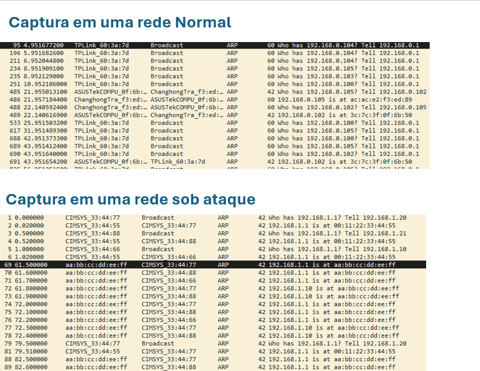
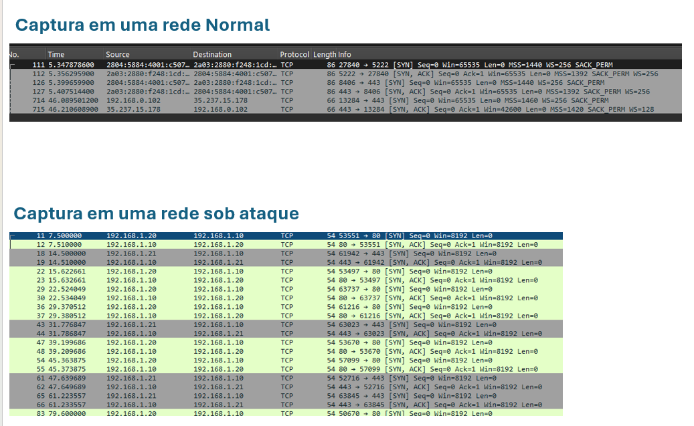

# Análise de Tráfego de Rede com Wireshark
### ARP Spoofing & TCP SYN — Tráfego Real vs. Tráfego sob Ataque

---

## Objetivo

Capturar tráfego da minha própria rede doméstica e comparar com um pcap de laboratório contendo um ataque simulado de **ARP Spoofing**, com o objetivo de identificar, na prática, os sinais que diferenciam uma rede funcionando normalmente de uma rede comprometida — olhando tanto para o comportamento do protocolo **ARP** quanto para a estrutura dos pacotes **TCP (SYN)**.

---

## 🛠️ Ferramentas utilizadas

- **Wireshark**
- **Sistema operacional:** Windows 11 (64-bit) — captura própria, interface Ethernet

---

## 🧪 Metodologia

| | Captura própria | Pcap de laboratório |
|---|---|---|
| **Interface** | Ethernet (Npcap) | — (arquivo pronto, sem captura ao vivo) |
| **Duração** | ~83 segundos | ~209 segundos (simulado) |
| **Pacotes** | 1075 | 184 |

Em ambos os casos, a técnica de investigação foi a mesma: aplicar filtros de exibição sucessivos no Wireshark — `arp` e `tcp.flags.syn == 1` — e comparar o resultado entre as duas capturas.

---

## 📦 Pacotes analisados

### 🔗 ARP — cada IP deveria ter sempre o mesmo MAC

O protocolo ARP associa um IP a um MAC na rede local e **não tem autenticação** — qualquer dispositivo pode responder por qualquer IP.

- **Rede normal (topo):** `TPLink_60:3a:7d`, `ASUSTekCOMPU_0f:6b:50` e `ChanghongTra_f3:ed:89` sempre respondem pelos mesmos IPs — cada IP aponta consistentemente para o mesmo MAC do início ao fim.
- **Rede sob ataque (embaixo):** nas linhas 1–6, tudo normal — três dispositivos perguntam quem é `192.168.1.1` e recebem sempre a mesma resposta (`00:11:22:33:44:55`). A partir da **linha 69 (t=61,5s)**, o MAC `aa:bb:cc:dd:ee:ff` passa a responder, sem ninguém ter perguntado, que ele é tanto `192.168.1.1` quanto `192.168.1.10` — e continua fazendo isso repetidamente daí em diante.

> ⚠️ **Não é uma alternância organizada entre a resposta legítima e a falsa.** A legítima só aparece quando alguém pergunta de novo (raro — só nas linhas 79/81, quase 20s depois). A falsa chega sem ninguém pedir, várias vezes seguidas, o tempo todo — o atacante inunda a rede muito mais rápido do que o gateway real consegue se corrigir.

### 🤝 TCP — o handshake e a estrutura do SYN também contam uma história

- **Rede normal (topo):** o three-way handshake (`SYN` → `SYN-ACK`) aparece com **opções TCP completas** — `MSS`, `WS` (Window Scaling) e `SACK_PERM` — e os pacotes têm 66 a 86 bytes. Essas opções são negociações que qualquer sistema operacional real faz ao abrir uma conexão de verdade.
- **Rede sob ataque (embaixo):** o handshake também ocorre corretamente (`SYN` → `SYN-ACK`), mas **sem nenhuma opção TCP** — só `Seq`, `Win` e `Len`, com pacotes de exatamente **54 bytes** (o tamanho mínimo possível). Além disso, uma conexão nova é aberta a cada poucos segundos entre os mesmos pares de IP (`192.168.1.20↔.10`, `192.168.1.21↔.10`), sempre repetindo o mesmo padrão.

---

##  Observações e conclusões

 **O que se comportou como esperado:** o three-way handshake TCP (SYN → SYN-ACK → ACK) ocorreu corretamente nas duas capturas, sem anomalias na camada de transporte — a diferença não está em *se* o handshake aconteceu, mas em *como* ele foi montado.

 **O que foi inesperado:**
- No ARP, um único MAC (`aa:bb:cc:dd:ee:ff`) se anunciando como dono de dois IPs diferentes (`192.168.1.1` e `192.168.1.10`) — assinatura clássica de **ARP Spoofing / Man-in-the-Middle**.
- No TCP, a ausência total de opções (MSS, WS, SACK_PERM) nos SYNs do cenário de ataque, junto com conexões novas e repetitivas a cada poucos segundos — indício de tráfego gerado por script, e não por navegação humana real.

 **Aprendizados:**
- Numa rede saudável, IP e MAC mantêm uma relação **estável**; um IP "trocando" de MAC é o sinal mais confiável de ARP Spoofing.
- A **estrutura** de um pacote TCP (tamanho, opções, frequência de novas conexões) pode denunciar tráfego automatizado, mesmo sem olhar o conteúdo da conversa.
- O próprio Wireshark ajuda na detecção automática: *Analyze > Expert Information* sinaliza esse tipo de conflito como **"Duplicate IP address configured"**.

---
🔁 Como reproduzir

1. Abra o Wireshark e selecione a interface de rede ativa (Ethernet ou Wi-Fi).
2. Inicie a captura **sem filtro** (*Start Capturing*).
3. Gere tráfego de propósito: acesse um site no navegador e dê um ping no gateway (`ping <IP do gateway>`, obtido via `ipconfig` no Windows).
4. Após 1–2 minutos, pare a captura e salve como `.pcapng` (*File > Save As*).
5. Aplique os filtros de exibição, um de cada vez, e compare com os prints acima:
   - `arp` → confira se cada IP aponta sempre para o mesmo MAC.
   - `tcp.flags.syn == 1` → confira o tamanho dos pacotes e se aparecem opções TCP (clique em cada SYN e expanda "Transmission Control Protocol > Options").
